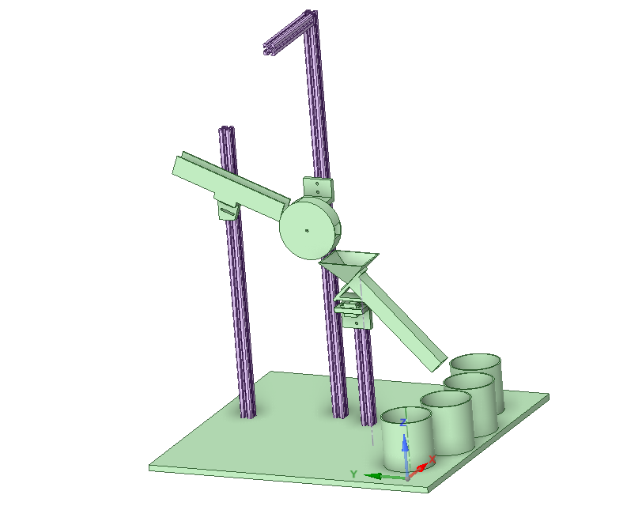

# Lizenz

MIT License

Copyright (c) 2024 Tobias Franzke

Permission is hereby granted, free of charge, to any person obtaining a copy
of this software and associated documentation files (the "Software"), to deal
in the Software without restriction, including without limitation the rights
to use, copy, modify, merge, publish, distribute, sublicense, and/or sell
copies of the Software, and to permit persons to whom the Software is
furnished to do so, subject to the following conditions:

The above copyright notice and this permission notice shall be included in all
copies or substantial portions of the Software.

THE SOFTWARE IS PROVIDED "AS IS", WITHOUT WARRANTY OF ANY KIND, EXPRESS OR
IMPLIED, INCLUDING BUT NOT LIMITED TO THE WARRANTIES OF MERCHANTABILITY,
FITNESS FOR A PARTICULAR PURPOSE AND NONINFRINGEMENT. IN NO EVENT SHALL THE
AUTHORS OR COPYRIGHT HOLDERS BE LIABLE FOR ANY CLAIM, DAMAGES OR OTHER
LIABILITY, WHETHER IN AN ACTION OF CONTRACT, TORT OR OTHERWISE, ARISING FROM,
OUT OF OR IN CONNECTION WITH THE SOFTWARE OR THE USE OR OTHER DEALINGS IN THE
SOFTWARE.

# Autoren
- **Tobias Franzke**

# Beschreibung der Anlage

Die Sortiermaschine sortiert D&D (Dungeons and Dragons) Würfel mit Hilfe von KI. Ein KI-Modell sortiert die Würfel nach 3 Farben (Klassen: rot, grün, blau, sonstig und Background), während das andere Modell die Formen der Würfel sortiert (Klassen: 20er Würfel, 8er Würfel, 6er Würfel, sonstig und Background).
Andere Farben oder Formen, die der KI nicht bekannt sind, werden in die 4 Behälter sortiert. Diese haben in den KI-Modellen die Klasse Sonstig.


# Die Anleitung zum Ausführen des KI-Projekts befindet sich im main branch.


# Modellansicht der Anlage




# Befehlsübersicht für das Arduino-Projekt

Diese Datei bietet eine Übersicht über alle verfügbaren UART-Befehle, ihre Funktionen und Beispiele für ihre Verwendung.

## Befehle

### Starten des Steppermotors
- **Beschreibung**: Startet den Steppermotor.
- **Befehl**: `start`

### Stoppen des Steppermotors
- **Beschreibung**: Stoppt den Steppermotor.
- **Befehl**: `stop`

### Befehl zum Drehen des Steppermotors
- **Beschreibung**: Dreht den Steppermotor um 1/3 des Rads.
- **Befehl**: `go`

### Einstellen der Drehrichtung des Steppermotors
- **Beschreibung**: Ändert die Drehrichtung des Steppermotors. `1` für im Uhrzeigersinn, `0` für gegen den Uhrzeigersinn.
- **Befehl**: `dir{Richtung}`
- **Beispiele**:
  - Im Uhrzeigersinn:
    ```
    diru
    ```
  - Gegen den Uhrzeigersinn:
    ```
    dirgu
    ```

### Einstellen der Servoposition
- **Beschreibung**: Einstellen der Position des Servomotors. Die Position sollte eine Zahl zwischen 0 und 180 sein.
- **Befehl**: `sg1{Position}`
- **Beispiel**:
  - Auf 120 Grad drehen:
    ```
    sg1120
    ```

### Einstellen der LED-Farbe
- **Beschreibung**: Einstellen der Farbe der LED über RGB-Werte. Jeder Wert kann zwischen 0 und 255 liegen.
- **Befehl**: `led{Rot}{Grün}{Blau}`
- **Beispiele**:
  - Rotes Licht:
    ```
    led255000000
    ```
  - Grünes Licht:
    ```
    led000255000
    ```
  - Blaues Licht:
    ```
    led000000255
    ```

### Bewegen des Servos zu einem Becher
- **Beschreibung**: Bewegt den Servo zur Position eines spezifischen Bechers.
- **Befehle**:
  - Becher 1:
    ```
    b1
    ```
  - Becher 2:
    ```
    b2
    ```
  - Becher 3:
    ```
    b3
    ```
  - Becher 4:
    ```
    b4
    ```

### Testmodus für den Servo
- **Beschreibung**: Aktiviert den Testmodus für den Servo.
- **Befehl**: `testservo`

### LED-Farbe einstellen nach Namen
- **Beschreibung**: Stellt die LED-Farbe ein basierend auf dem Namen der Farbe.
- **Beispiele**:
  - Für Blau:
    ```
    "blue" oder "blau"
    ```
  - Für Grün:
    ```
    "green" oder "gruen"
    ```
  - Für Weiß:
    ```
    "white" oder "weiss"
    ```
  - Für Schwarz:
    ```
    "black" oder "schwarz"
    ```
  - Für Lila:
    ```
    "purple" oder "lila"
    ```
  - Für Rot:
    ```
    "red" oder "rot"
    ```
  - Für Gelb:
    ```
    "yellow" oder "gelb"
    ```
  - Für Sonstiges (leuchtet Cyan):
    ```
    "sonstig" oder "other"
    ```

### Unbekannter Befehl
- **Beschreibung**: Wird ausgegeben, wenn ein eingegebener Befehl nicht erkannt wird.
